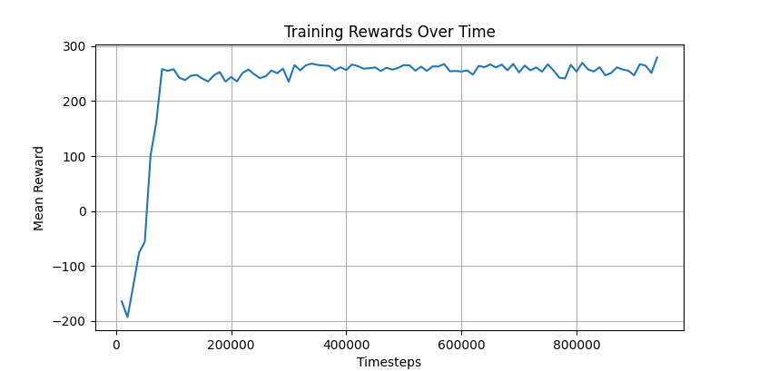
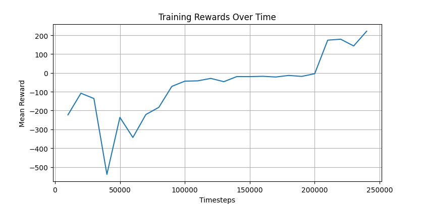

# Lunar Lander Reinforcement Learning Project

This project implements reinforcement learning agents for the LunarLander-v3 environment using Proximal Policy Optimization (PPO) from Stable-Baselines3. The repository contains implementations for both continuous and discrete action spaces, allowing for comprehensive comparison between the two approaches.

## Overview

The Lunar Lander environment is a classic reinforcement learning challenge where an agent must learn to safely land a spacecraft. The environment provides two variants:
- **Discrete actions**: Four discrete actions (do nothing, fire left engine, fire main engine, fire right engine)
- **Continuous actions**: Two continuous values controlling the main engine and side engines

## Project Structure

```
lunar_lander/
├── continuous/
│   ├── training.py              # PPO training for continuous actions
│   ├── testing.py               # Model evaluation with rendering
│   ├── visualizing.py           # Training progress visualization
│   ├── continuous_training_graph.png
│   ├── models/                  # Saved models and normalization parameters
│   └── logs/                    # Training evaluation logs
├── discrete/
│   ├── training.py              # PPO training for discrete actions
│   ├── testing.py               # Model evaluation with rendering
│   ├── visualizing.py           # Training progress visualization
│   ├── discrete_training_graph.png
│   ├── models/                  # Saved models and normalization parameters
│   └── logs/                    # Training evaluation logs
├── requirements.txt             # Project dependencies
└── README.md                    # Project documentation
```

## Training Results

### Continuous Action Space
The continuous action space implementation shows stable learning with the agent reaching optimal performance around 250-300 reward points.



### Discrete Action Space
The discrete action space implementation demonstrates different learning dynamics, with more volatile initial training but eventual convergence to good performance.



## Installation

Install the required dependencies:

```bash
pip install -r requirements.txt
```

## Usage

### Training

To train a model for continuous actions:
```bash
cd continuous
python training.py
```

To train a model for discrete actions:
```bash
cd discrete
python training.py
```

Both training scripts include options for multi-seed training to improve robustness. The training process automatically saves the best model based on evaluation performance and stops when reaching the target reward threshold.

### Testing

To test a trained model:
```bash
cd continuous  # or discrete
python testing.py
```

This will load the best model and run evaluation episodes with rendering enabled, allowing you to observe the agent's performance.

### Visualization

To generate training progress graphs:
```bash
cd continuous  # or discrete
python visualizing.py
```

## Model Configuration

The PPO models are configured with the following key parameters:
- Learning rate: Linear decay from 3e-4 to 0
- Batch size: 64
- Training steps: 2048 per update
- Epochs: 10 per update
- Gamma: 0.999 (discount factor)
- GAE Lambda: 0.95
- Entropy coefficient: 0.01

The continuous model targets a reward threshold of 270, while the discrete model targets 220.

## Environment Details

- **Environment**: LunarLander-v3 from Gymnasium
- **Observation space**: 8-dimensional continuous space (position, velocity, angle, etc.)
- **Action spaces**: 
  - Continuous: 2-dimensional continuous actions
  - Discrete: 4 discrete actions
- **Success criteria**: Land between the flags with minimal fuel consumption and gentle touchdown

## Dependencies

Key libraries used in this project:
- `stable-baselines3`: PPO implementation and training utilities
- `gymnasium`: OpenAI Gym environments
- `matplotlib`: Visualization of training progress
- `numpy`: Numerical computations
- `torch`: Deep learning framework (backend for Stable-Baselines3)
